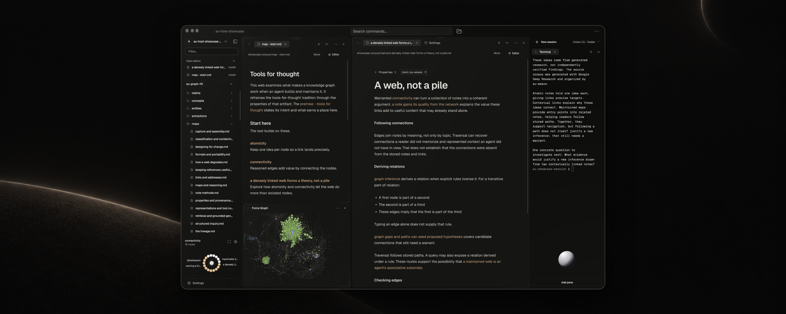

# arsumbris

> Early alpha. Expect breaking changes.
> Macos only for now.

A malleable, agent-native IDE for typed knowledge.



Built on a type engine and an extensible agent framework. Knowledge, types, skills, tools and UI components live together in composable repos.

Repos can depend on each other, letting you reuse knowledge and capabilities across projects.

The engine reads them as one typed graph, checks fields and references and gives agents diagnostics they can act on.

Connect your agent harness through MCP.
You and your agent can build tools, add views and modify the app with the same primitives and SDKs we used to build it.


## How to install

Paste the following to your agent:
```
Please help me install Ars Umbris.

1) Create two folders if they do not already exist:
   - ~/arsumbris/ will hold multiple repositories.
   - ~/.arsumbris/ will hold configurations.

2) Clone the entry-point repository:
   git clone https://github.com/arsumbris/arsumbris.git ~/arsumbris/arsumbris
   If that destination already exists, inspect it before proceeding; do not overwrite it.

3) Read ~/arsumbris/arsumbris/INSTALL.md and follow its current setup process.
   Check prerequisites and explain any changes needed on my machine before making them.
```


## The three layers

### 1) au-engine
The cross-repo graph engine over a typed file substrate.

Indexes the cross-repo file substrate,
turning it into a typed, queryable, live graph.

Implements a custom typing language for markdown and yaml files.

See [au-engine.md](au-engine.md)

### 2) au-host
Electron host application that mounts typed *projections* (views) over the graph

Config driven compositions over typed data.
Editable and drivable by humans and agents.

See [au-host.md](au-host.md)

### 3) au-mcp
An extensible agent layer that provides typed tools and skills via mcp.

Interfaces with your harness of choice through adapters.

See [au-mcp.md](au-mcp.md)

## Install

See [INSTALL.md](INSTALL.md) for what to install, in which order.

## Status

Early alpha release, under active development.
Expect bugs and breaking changes.

Runs code on your machine, with no sandboxing yet.
See [SAFETY.md](SAFETY.md).
